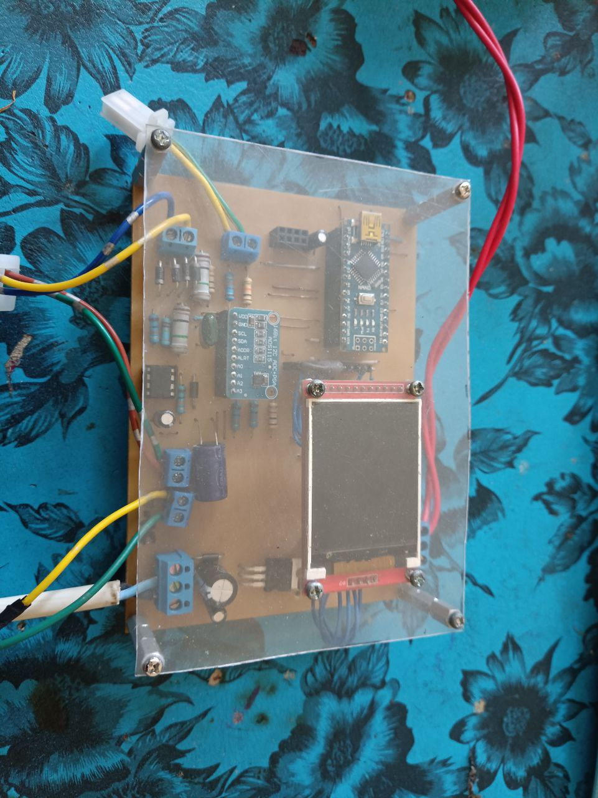
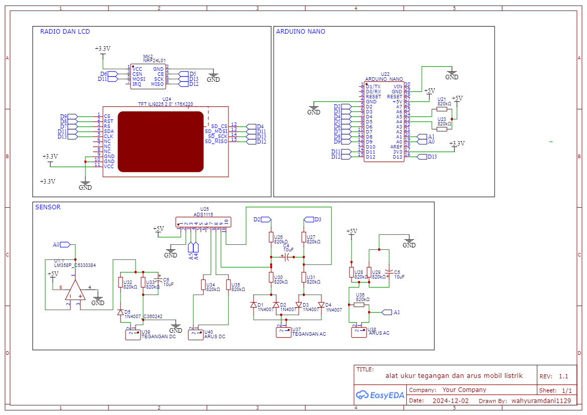

# tugasAkhir

## Description
Selamat datang di project tugas akhir saya, alat pada tugas akhir saya ini memiliki fungsi untuk merekam nilai arus dan tegangan, Ac maupun Dc dari mobil listrik milik Fakultas Teknik Universitas Mataram secara realtime, di rancang untuk mengukur tegangan SPWM yang keluar dari controller mobil listrik. alat ukur ini terkalibrasi dengan power meter Fluke PQ 345 Clamp Meter.

## Komponen
1. Arduino Nano
2. LCD TFT ILLI9225
3. ADS1115
4. OpAmp LM358P
5. SDCard Modul
6. Diode UF4007
7. Regulator 12 Volt
8. Resistor 1M, 1K, 10K
9. Capacitor 10 mF, 100 mF

## Kontribusi
Kami menyambut semua kontribusi! Berikut ini beberapa cara untuk memulai:
1. Laporkan bug: Jika Anda menemukan bug, harap beri tahu kami. Ajukan masalah dan beri tahu kami masalahnya.
2. Kontribusikan kode: Jika Anda seorang pengembang dan ingin berkontribusi, ikuti petunjuk di bawah ini untuk memulai!
3. Saran: Jika Anda tidak ingin membuat kode tetapi memiliki beberapa ide hebat, ajukan masalah yang menjelaskan beberapa pembaruan atau peningkatan yang ingin Anda lihat!
4. Dokumentasi: Jika Anda merasa perlu beberapa dokumentasi tambahan, silakan tambahkan!

## Instruksi
1. Fork repositori ini
2. Kloning repositori yang di-fork
3. Tambahkan kontribusi Anda (kode atau dokumentasi)
4. Komit dan dorong
5. Tunggu permintaan penarikan digabungkan

